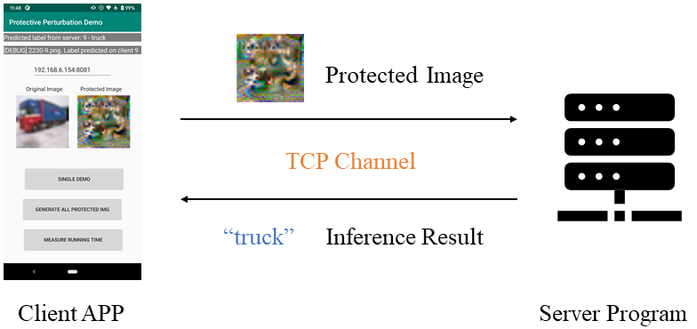
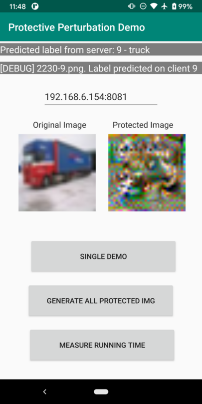

# Protective Perturbation - MMSys 2022

In this project, we develop a protective perturbation generator at the user end, which adds
perturbations to the input images to prevent privacy leakage. In the meantime, the image recognition model still runs at
the service provider end to recognize the protected image without the need of being re-trained. The detail of this project
is described in our recently accepted MMSys'22 paper:

Mengmei Ye, Zhongze Tang, Huy Phan, Yi Xie, Bo Yuan, Sheng Wei. Visual Privacy Protection in Mobile Image Recognition Using Protective Perturbation. ACM Multimedia Systems Conference (MMSys), June 2022.

A draft version of the paper is under the `paper` folder, and the camera-ready version will be available in April 2022.

This repo contains both code and instructions for the following three components:

- Set up the end-to-end image recognition system (both client and server) with the protective perturbation generator deployed at the client using our pre-trained model.
- Train our protective perturbation generator, with different target models and auxiliary models.
- Reproduce the experimental results reported in the paper.

## Repository Hierarchy

```text
 |-----server                            // server-end code, model training and results reproduction
       |-----cifar10_models              // pre-trained image recognition models for CIFAR10
       |-----generator_models            // pre-trained protective perturbation generators 
       |-----recv_from_phone             // folder to store images sent by the client
       |-----mobile_server.py            // server program
       |-----train.py                    // main program to train a protective perturbation generator
       |-----mobile_result_file_gen.py   // reproduce accuracy and SSIM results
       |-----cpu_gpu_timing.py           // reproduce timing results
       |-----module.py                   // the wrapper model of the generator to be trained
       |-----...                         // some other supplementary util codes
 |-----client                            // client-end code
       |-----app                         
             |-----src                   // source code of the Android APP
             |-----build.gradle          // gradle config
       |-----build.gradle                // gradle config
       |-----...                         // some other config files
 |-----paper
       |-----ProtectivePerturbation.pdf  // draft version of the paper
       |-----README.md
 ```

## 1. Environment Setup

In this project, we use the same workstation (i.e., the server) to run the server program, develop and train the generators, analyze and produce the results reported in the paper, and develop and compile the Android client APP.

### Hardware Requirements

#### Server

A workstation or desktop computer with GPU is required (additional modification to the code is needed if without GPU). In our experiments, an Nvidia RTX A6000 GPU is used.

#### Client

Theoretically, the APP can run on any Android phone w/ ARMv8 CPU and Android 8.0 or higher. The client APP has been fully tested on a Pixel 3 and a OnePlus 5T. All the results were collected on the Pixel 3. At least 2.5 GB free space on the phone is required to run the end-to-end system, and 6.0 GB is required if you want to collect all the experimental results.

### Software Requirements

#### Server - server program, model training, results reproduction

This project is developed and tested in the following system:
```text
Ubuntu 20.04 LTS
CUDA 11.5
Python 3.6
PyTorch 1.7.1+cu110
PyTorch-Lightning 1.2.3
```

Please set up the development environment by following the instructions below:

1. (IMPORTANT) We recommend using PyCharm to open the `server` folder directly, and set up everything for the server-end in the integrated terminal of PyCharm or using GUI.

2. Update Ubuntu first.

    ```shell
    sudo apt update
    sudo apt upgrade
    ```

3. Install [CUDA](https://developer.nvidia.com/cuda-downloads) (a version >=11.0 && <12.0 is okay)
following the official instructions.

4. (Optional) Install [Anaconda](https://docs.conda.io/projects/conda/en/latest/user-guide/install/linux.html) to setup 
a virtual environment. This will help protect your dev environment from being a mess. 
Setup the Conda virtual environment w/ Python 3.6. We highly recommend using PyCharm GUI to do so directly.
If you prefer command line, try the following command to create a virtual environment called `ProtectivePerturbation_MMSys22`.
    ```shell
    conda create -n ProtectivePerturbation_MMSys22 python=3.6
    conda activate ProtectivePerturbation_MMSys22
    ```

5. Install the required libraries (in the virtual environment if you have one).

    ```shell
    pip install torch==1.7.1+cu110 torchvision==0.8.2+cu110 torchaudio==0.7.2 -f https://download.pytorch.org/whl/torch_stable.html
    pip install matplotlib pytorch-lightning==1.2.3 wandb xlsxwriter
    ```
6. Download `original_target_model.zip` from 
[this link](https://drive.google.com/drive/folders/1I4jlTiGbqp19_ZF5MTm9RuH8MJcNEVPR?usp=sharing)
and extract all the `.pt` files to `<ProjectFolder>/server/cifar10_models/state_dicts/`.
7. Download `original_model.zip` from 
[this link](https://drive.google.com/drive/folders/1I4jlTiGbqp19_ZF5MTm9RuH8MJcNEVPR?usp=sharing)
and extract all the `.ckpt` files to `<ProjectFolder>/server/generator_models`.

#### Server - client APP development (skip this section if you do not need to modify the client APP)

1. Use Android Studio to open the `client` folder.
2. Download the CIFAR10 dataset (`cifar10_test5000.zip`), protective perturbation generator models 
(`mobile_model.zip`), and target models (`mobile_target_model.zip`) from 
[this link](https://drive.google.com/drive/folders/1I4jlTiGbqp19_ZF5MTm9RuH8MJcNEVPR?usp=sharing).

    Extract these three zip files to `<ProjectFolder>/client/app/src/main/assets`. After extraction, the
    `assets` folder looks like below:
    
    ```text
    assets
    ├── cifar10
    │   ├── 0000-7.png
    │   ├── 0001-5.png
    │   ├── 0002-7.png
    │   ├── ...
    ├── model
    │   ├── densenet121-X-densenet121.ptl
    │   ├── densenet121-X-googlenet.ptl
    │   ├── ...
    ├── PUT_ASSETS_HERE
    └── target_model
        └── mobilenet_v2.ptl
        └── ...
    ```

3. Modify the code, then Android Studio will handle the rest of things for you.


## 2. End-to-end System Setup and Execution Using Our Pre-trained Model

### Set Up the Server

As shown in Fig 5 of our paper, our end-to-end system consists of a mobile app running on an Android
smartphone and a server running on a workstation.
<p align="center">

<!--  -->
Figure 5 of the paper: Mobile system implementation
</p>
To set up the server, please follow the steps below:

1. Find the IP of the server. Open a Terminal and use `ip addr` to check the IP address. The result is something like 
below, where `enp9s0` is the name of the NIC, and `192.168.6.164` is the IP address. You need to use the same IP address
in the client APP.
    ```text
    1: lo: <LOOPBACK,UP,LOWER_UP> mtu 65536 qdisc noqueue state UNKNOWN group default qlen 1000
        link/loopback 00:00:00:00:00:00 brd 00:00:00:00:00:00
        inet 127.0.0.1/8 scope host lo
           valid_lft forever preferred_lft forever
    2: enp9s0: <BROADCAST,MULTICAST,UP,LOWER_UP> mtu 1500 qdisc mq state UP group default qlen 1000
        link/ether xx:xx:xx:xx:xx:xx brd ff:ff:ff:ff:ff:ff
        inet 192.168.6.154/24 brd 192.168.6.255 scope global dynamic noprefixroute enp9s0
           valid_lft 79207sec preferred_lft 79207sec
    ```

2. In `server/mobile_server.py`, change the `HOST` variable (`str`) to the IP address you find above. Change the `PORT` if `8081` is 
not available.

3. In `server/mobile_server.py`, change the `DATA_DIR` variable (`str`) to `<Project Folder Path>/server/recv_from_phone`,
a folder that has existed in the root of the project folder.

4. Run `server/mobile_server.py`. 
    ```shell
    cd server  # always make the server folder as your work folder when you try to run code on server!
    python mobile_server.py
    ```
    The server starts up successfully if you see the messages below:
    ```text
    Global seed set to 0
    Init server successfully.
    Waiting for connection...
    ```
    Below is an example when the server receives a protected image from the client successfully:
    ```text
    New connection <socket.socket fd=21, family=AddressFamily.AF_INET, type=SocketKind.SOCK_STREAM, proto=0, laddr=('192.168.6.154', 8081), raddr=('192.168.6.218', 38272)> ('192.168.6.218', 38272)
    Receiving image w/ size 3049
    Received recv_from_phone/0.png successfully
    Predicted label 4
    ```

### Set Up the Client

To set up the client APP, please follow the steps below:

1. Install the APP.

    We recommend using ADB to install the APP. You have to enable 
    [USB debugging](https://developer.android.com/studio/debug/dev-options#enable) on the phone first,
    and then connect it to your machine via a USB cable. After that, install ADB on the machine. 

    ```shell
    sudo apt install adb  # install adb on Ubuntu
    adb devices  # list connected devices
    ```

    If the phone is connected correctly, you will see outputs like below.

    ```text
    List of devices attached
    XXXXXXXXX	device
    ```

    Then download the client APP `ProtectivePerturbationDemo.apk` from [this link](https://drive.google.com/drive/folders/1I4jlTiGbqp19_ZF5MTm9RuH8MJcNEVPR?usp=sharing) and install it using ADB.

    ```shell
    adb install ProtectivePerturbationDemo.apk
    ```

    You always can simply copy & paste 
    it to your phone, and install it manually. But ADB is preferred as it is helpful to obtain 
    protected images from the phone.

    > Internet connection permission is required for this APP.

1. Make sure the server is up, and you already have the server IP address and the port number. Connect the phone to the same network as the server does.

2. Replace `192.168.6.154:8081` showing on the APP with `Your_Server_IP_Address:Port_Number`. The IP 
address and the port number of your server is set in `server/mobile_server.py`.

3. Click the button `SINGLE DEMO`. The client APP will pick one of the 5000 images from the dataset 
randomly and send it to the server. The original image and the protected image (generated by the APP)
will be shown on the screen, and the protected one will be sent to the server. If everything is okay,
the server will call the target model and return the result to the phone.

    An example is shown below. The first line `Predicted label from server: 9 - truck` is based on 
    the returned result from the server. The second line shows some debug info. `2230-9.png` is the
    name of the randomly-chosen figure, where `2230` is the index and `9` is the ground truth label.
    `Label predicted on client 9` is the label classified by the target model running on the phone.
    This target model is the same as the one running on the server, and just for debug only.

    <p align="center">
    
    </p>
    <p align="center">
    Example of the client demo
    </p>

This demo uses `Mobilenet_v2` as the target model. If you want to try another generator, simply change
the number 25 in [Line 75](https://github.com/hwsel/ProtectivePerturbation/blob/main/client/app/src/main/java/rutgers/hwsel/ProtectivePerturbation/MainActivity.java#L75) and 76 to some other number `i` (0<=i<64) in `MainActivity.java`. Also,
change `target_model` accordingly in the `server/mobile_server.py` of the server. Refer to [Server - client APP development](#server---client-app-development-skip-this-section-if-you-do-not-need-to-modify-the-client-app) section for more instructions.

## 3. Model Training

In `server/train.py`, `data_dir` and `gpu_id` needs to be customized based on the setting of your environment. Change other 
settings by demand. You can also use command line instead, for example:

```shell
python train.py \
         --data_dir <your data dir> \
         --model_A resnet18 \
         --model_B resnet18 \
         --gpu_id <your gpu id> \
         --description "resnet18-X-resnet18"
```

You can also use `all_in_one_script.sh` to retrain all the models.

```shell
bash all_in_one_script.sh <gpu id>
```

## 4. Reproducing the Experimental Results in the Paper

### Effectiveness Evaluation

1. Generate all the protected images on the client APP first.
    > WARNING:
    > It takes about 2.5 hours on a Pixel 3. You should put the phone down and keep the APP in 
    > the foreground to avoid any interruption.

    All the 64 protective perturbation generators and 5000 test images have already been included in the 
    prebuilt APK. 

    To reproduce the results of our paper, you need to collect all the protected images of the 64 different
    perturbation generators. In total, there will be 320,000 images. To do so, just simply click
    `GENERATE ALL PROTECTED IMG` button, and wait until see `Generating pics done.` on the screen.

    To copy all the images from the phone to the workstation, use ADB:

    ```shell
    adb pull /sdcard/Android/data/rutgers.hwsel.ProtectivePerturbation/files <path to your data folder>
    ```

    > WARNING:
    > DO NOT USE MTP, as it is very unstable. If it interrupts frequently, try different USB ports or cables.
    > It takes about an hour to pull all the 320,000 images from a Pixel 3 to the workstation.

2. Download the CIFAR10 dataset (`cifar10_test5000.zip`) from 
[this link](https://drive.google.com/drive/folders/1I4jlTiGbqp19_ZF5MTm9RuH8MJcNEVPR?usp=sharing), and extract it to `<data folder>` (i.e., the folder where you `adb pull` all the images to in the previous step).
Now in `<data folder>`, you should have 65 folders, under each there are 5000 images.
3. Modify `data_dir` in `server/mobile_result_file_gen.py` to the path of `<data folder>`.
4. Run `server/mobile_result_collect.sh` to calculate the results (accuracy for the target model & the auxiliary model, SSIM) 
for all the protected images.
```shell
cd server  # always in the server folder when you try to run something of the server
bash mobile_result_collect.sh
```
5. In the generated `mobile_result_mobisys2022.txt`, you can see the results are listed as follows:
   - Protective perturbation generator name (in the format of `target model-X-auxiliary model.ptl`)
   - Accuracy of the target model to classify protected images
   - Accuracy of the auxiliary model to classify protected images
   - SSIM between the original images and the protected images

### Overhead Evaluation

1. In `mobile_model.zip`, you can check the size of all the protective perturbation generators.
2. For the timing results of CPU and GPU, you can use the code in `cpu_gpu_timing.py` to collect all the results.
   You have to change `data_dir` to an accessible folder where can put CIFAR-10 dataset, and the code will download it 
   automatically.
3. For the timing results of mobile, follow the instructions below:
   > WARNING:
    > You should put the phone down and keep the APP in the foreground when measuring the time.

    Click the button `MEASURE RUNNING TIME` of the APP. After it is done, you will see 
    `Time measurement done.` on the screen.

    To pull the results, use the following command:

    ```shell
    adb pull /sdcard/Android/data/rutgers.hwsel.ProtectivePerturbation/files/time_result.txt ./
    ```

    Check the `time_result.txt` you can see the generator name (the name before `-X-` is the target model)
    followed by the timing results (in milliseconds) for 5000 images.

    The timing results could be different from the paper, due to different phone models, APPs
    installed, and even current temperature. To get the most accurate result, you should modify the
    loop in the OnClickListener() of getTimeBtn (around line 175 in `MainActivity.java`) to run the time
    measurement one by one manually.

    To be more specific, after the measurement for `modelList[i]` (0<=i<8) is done, idle
    or even shut down the phone for five minutes, and then do `modelList[i+8]`, until i>=64. We only do
    8 models because there are 64 protective perturbation generators, but 8 target models in total,
    which means we just need to measure the time for 8 target models with the same auxiliary model.

## 5. Miscellaneous

### Model Conversion - From Original to Mobile

We follow the [official example](https://github.com/pytorch/android-demo-app/blob/master/HelloWorldApp/trace_model.py) 
to convert all the target models and protective perturbation generator models from original version to the mobile version, so that the converted version of the model can run on the smart phone with the help of PyTorch Mobile.

Check `server/mobile_model_export.py` for the detailed code. Remember to change `GENERATOR_MODEL_SAVE_FOLDER` and `TARGET_MODEL_SAVE_FOLDER`.

### Uninstall the Client APP

Since the APP uses assets and internal usage to store the files, just simply uninstall the APP as 
normal, and everything will be gone.


## 6. Trouble Shooting

### ERROR: Cannot uninstall 'certifi'.

When install matplotlib, you may see the error:
>  Attempting uninstall: certifi  
    Found existing installation: certifi 2016.9.26  
ERROR: Cannot uninstall 'certifi'. It is a distutils installed project and thus we cannot accurately determine which files belong to it which would lead to only a partial uninstall.

Use the following commands to fix the error:

```shell
pip install certifi --ignore-installed
pip install matplotlib pytorch-lightning==1.2.3 wandb xlsxwriter
```

## 7. Cite Our Work

Mengmei Ye, Zhongze Tang, Huy Phan, Yi Xie, Bo Yuan, Sheng Wei. Visual Privacy Protection in Mobile Image Recognition Using Protective Perturbation. ACM Multimedia Systems Conference (MMSys), June 2022.

## 8. Contact

If you have any questions or any idea to discuss, you can email Zhongze Tang (zhongze.tang@rutgers.edu) directly.

## 9. References

In this project, the code and weights of classification models for CIFAR-10 dataset is from the project
[PyTorch models trained on CIFAR-10 dataset](https://github.com/huyvnphan/PyTorch_CIFAR10).

## 10. License

MIT
